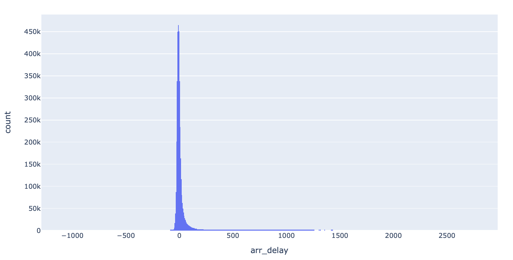

## Task 1
#### Does the delay data have a normal distribution?
-> No, mean is in negative not 0, and it is positively skewed. Therefore, it is not normally distributed.
I also did a quartile-quartile test and Shapiro-Wilk test in another file. It was NOT normal.

## Dataset 
Click [here](https://drive.google.com/drive/folders/1WYXv9SIV6KJnUOPek8Uu68IJK779S8ef?usp=sharing). You will be redirected to Google Drive.
