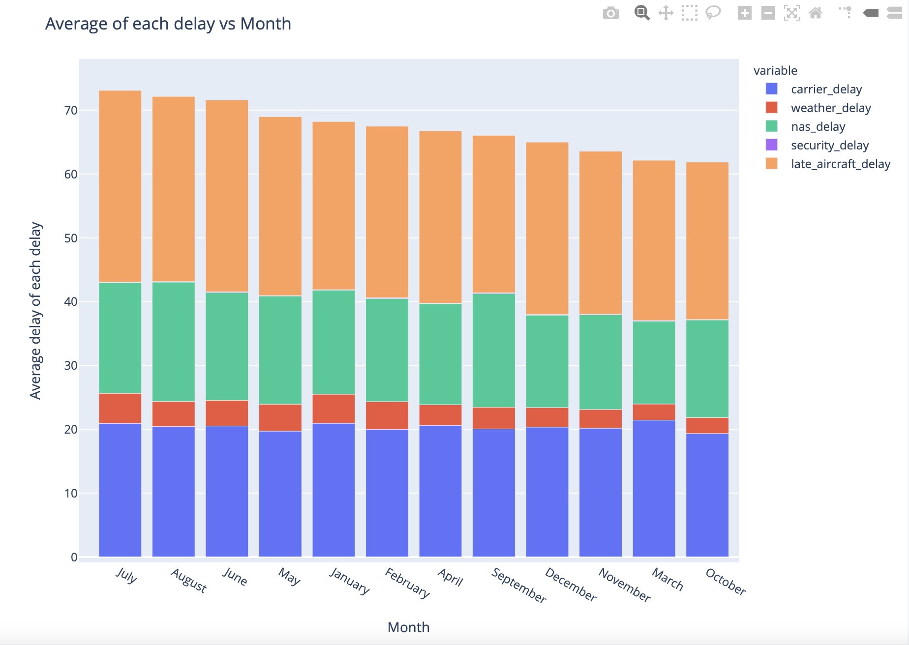

## Task 3
#### What is the average percentage of delays that is already created before departure? (aka are arrival delays caused by departure delays?) Are airlines able to lower the delay during the flights?

 

## Dataset
Click [here](https://drive.google.com/drive/folders/19no88ESp5d3TBHcO9uUH_9DMVhX-OV5j?usp=sharing). You will be redirected to Google Drive.
