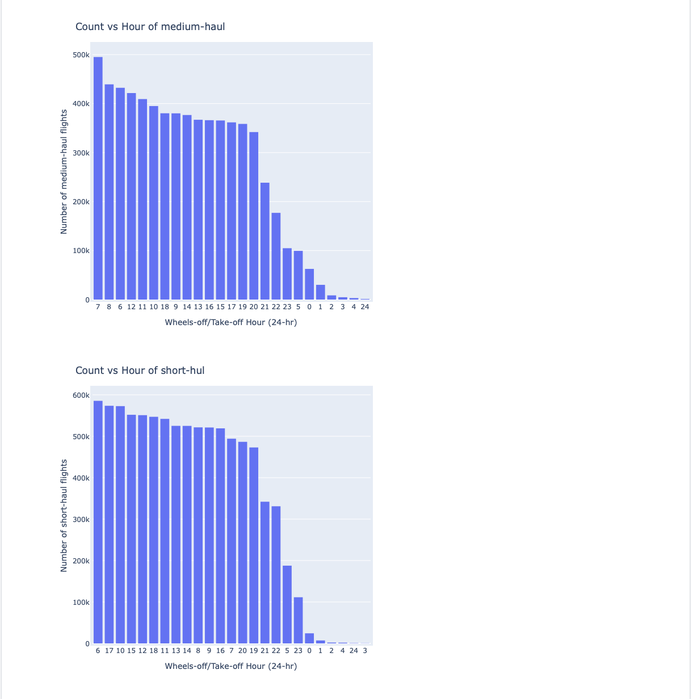

## Task 6
#### When (which hour) do most 'LONG', 'SHORT', 'MEDIUM' haul flights take off?

    

## Dataset
Click [here](https://drive.google.com/drive/folders/1v6HjTURy5QAM2Z6rHq3vI1xayKgE1_Qm?usp=sharing). You will be redirected to Google Drive.
